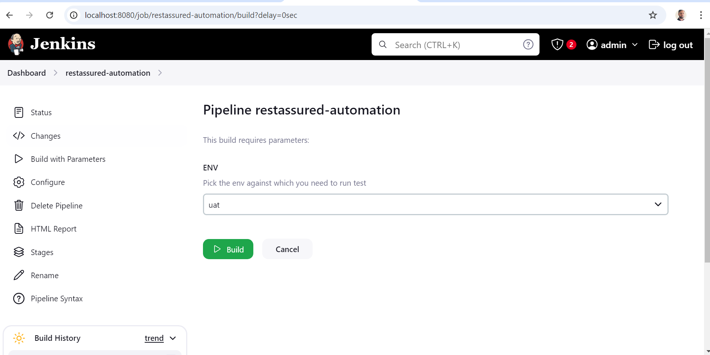
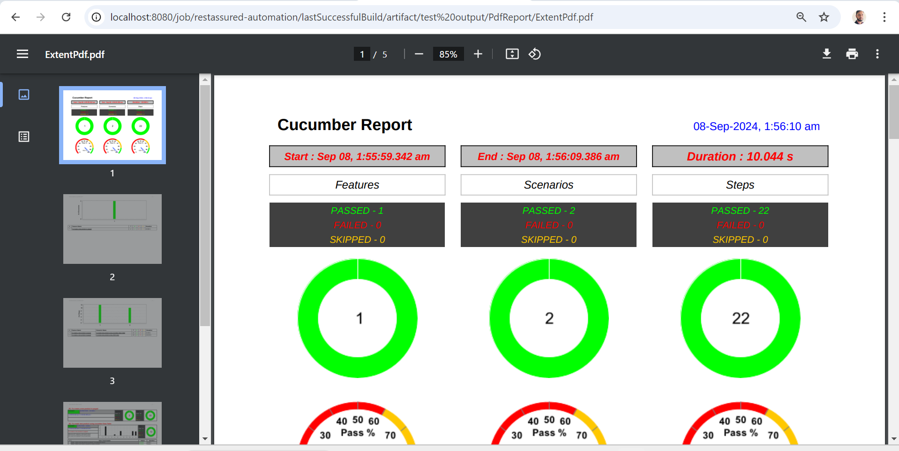

# **PayPal API Automation**

### **Overview**
API is application program interface, it's a piece of code used locally to perform specific operation like Apache POI, Selenium jars. When an API is available over the network for interaction between 2 applications then its called as Web Services API.
This API automation framework is developed using RestAssured with Cucumber.Rest Assured is a Java library that provides interfaces and classes using which you can send API request and receive responses. Cucumber is an open source library, which supports behavior driven development. 
To be more precise, Cucumber can be defined as a testing framework, driven by plain English text. This API automation is done on PayPal API's which is secured by OAuth2.0. We are generating a Token based authentication programmatically before making api request.

### **Some of the key features of this framework:**
1. It generates Extent report with all the step details. Report will be generated both HTML & PDF file format.
2. Generates execution logs, with detailed request and response details.
3. Feature file has examples of reading request details from json and cucumber Datatable.
4. This also has an example to validate response body using json schema and java pojo classes.
5. Test execution can be triggered form command line.
6. Easy integration to CI/CD pipeline.

### **Running Test:**
Open the command prompt and navigate to the folder in which pom.xml file is present. Run the below Maven command.

mvn clean test

Once the execution completes report & log will be generated in below folder.

Report: target/report

Log: target/logs

### **Authentication and Authorization**
The PayPal api is secured by Oauth2.0. I have created a Utility class TokenGenerator using oltu.oauth2.client which returns a Bearer Token in base64 encoded format. This bearer token value is then sent in httpRequest header while creating the Request Specification.

### **Parallel Testing**
We are using @DataProvider annotation with attribute parallel=true to run all the scenarios in parallel.

### **Deserialization**
We have created a utility ResponseHandler to achieve deserialization. Deserialization is a process of converting json string literal response to java object. To Achieve this we are using ObjectMapper class from Jackson library. The simple readValue API of the ObjectMapper is used to parse or deserialize json string literal to Java Object.
Below is a simple example of converting a JSON String to a Java object using the ObjectMapper class:

String json = "{ \"color\" : \"Black\", \"type\" : \"BMW\" }";
Car car = objectMapper.readValue(json, Car.class);

The readValue() function also accepts other forms of input, such as a file containing JSON string:

Car car = objectMapper.readValue(new File("src/test/resources/json_car.json"), Car.class);

### **Why Deserialization**
For deserialization, we create a separate class that has same variables as present in JSON response. Basically this helps to validate the datatype of json. In case wrong datatype is received deserialization will throw error. This is easy to maintain for complex jsons. For data validation we need to write assertions.

### **Serialization**
Serialization is a process of converting POJO class objects to JSON. In RestAssured we send the Java class object in the body method and rest assured serializes it into json string and sends it over.

RequestSpecification httpRequest = RestAssured.given();

httpRequest.header("Accept", "application/json");

httpRequest.body(javaObject);

### **Query Parameter and Path Parameter**
URI, endpoint, Query parameter, Path parameter

https://api-m.sandbox.paypal.com/v1/catalogs/products/{productID}
https://api-m.sandbox.paypal.com/v1/catalogs/product?category=toys

Protocol- https

baseURL- api-m.sandbox.paypal.com

endpoint- /v1/catalogs/products

1. Path Parameter- {productID}

httpRequest.pathParam("productID", context.session.get("productID"))

Path parameter is used to identify specific resource using its unique identifier.Path parameters are variables in URL that you can pass to identify specific resource.

2. Query Parameter-starts with ? followed by parameter and value

httpRequest.queryParam("category","toys")

Query parameter is used when we want to filter or sort the items. Query parameters are the type of parameters that are added after the question mark ( ? ). 
Usually, query parameters come in a key-value pair that is separated by an equal sign ( = ), and each key-value pair is joined together by an ampersand ( & ).
https://api.example.com/users?id=123&name=John%20Appleseed

The key-value parameter pairs that we can see are:

id with a value of 123.
name with a value of John Appleseed.

### **Jenkins Job and Results**

